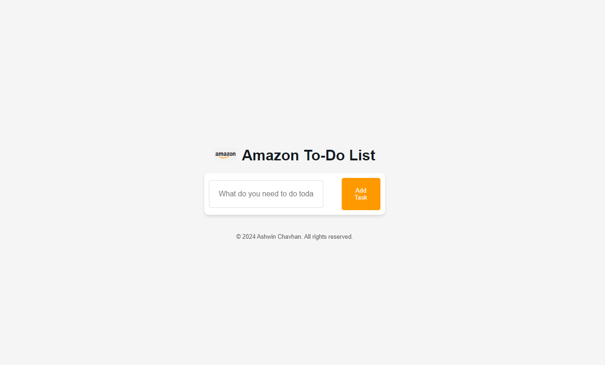

# Amazon To-Do List

## Project Overview

The **Amazon To-Do List** is a task management web application designed with a sleek, Amazon-inspired interface. Users can add, complete, and delete tasks, with all tasks being stored in the browser's local storage for persistent use.

## Features

- Add new tasks to the to-do list.
- Mark tasks as completed with a single click.
- Delete tasks easily.
- Tasks are saved in the browser's local storage, ensuring they persist even after refreshing the page.
- Responsive design for seamless usage on various devices.

## Tech Stack

- **HTML5**: Structure of the application.
- **CSS3**: Styling and layout.
- **JavaScript**: Functionality and local storage management.

## Folder Structure

```
project-folder/
│
├── index.html          # Main HTML file
├── style.css           # CSS file for styling
├── script.js           # JavaScript file for functionality
├── images/             # Folder containing images (e.g., icons, logo)
│   ├── amazon-logo.png
│   ├── check-icon.png
│   ├── delete-icon.png
```

## Setup Instructions

1. Clone the repository:
   ```bash
   git clone https://github.com/ASHWIN-CHAVHAN-121/To-Do-List.git
   ```
2. Navigate to the project folder:
   ```bash
   cd To-Do-List
   ```
3. Open `index.html` in any modern web browser to view the application.

## Usage

1. Enter a task in the input field and click **Add Task** or press **Enter**.
2. To mark a task as completed, click the check icon next to the task.
3. To delete a task, click the delete icon next to the task.
4. Tasks will be saved automatically and persist after refreshing the page.

## Screenshots



## Demo 🎥

[Live Demo](#) *(https://ashwin-chavhan-121.github.io/To-Do-List/)*

---

## Author

**Ashwin Chavhan**

## License

This project is licensed under the MIT License. See the `LICENSE` file for details.

---

Feel free to contribute to this project by submitting issues or pull requests!


